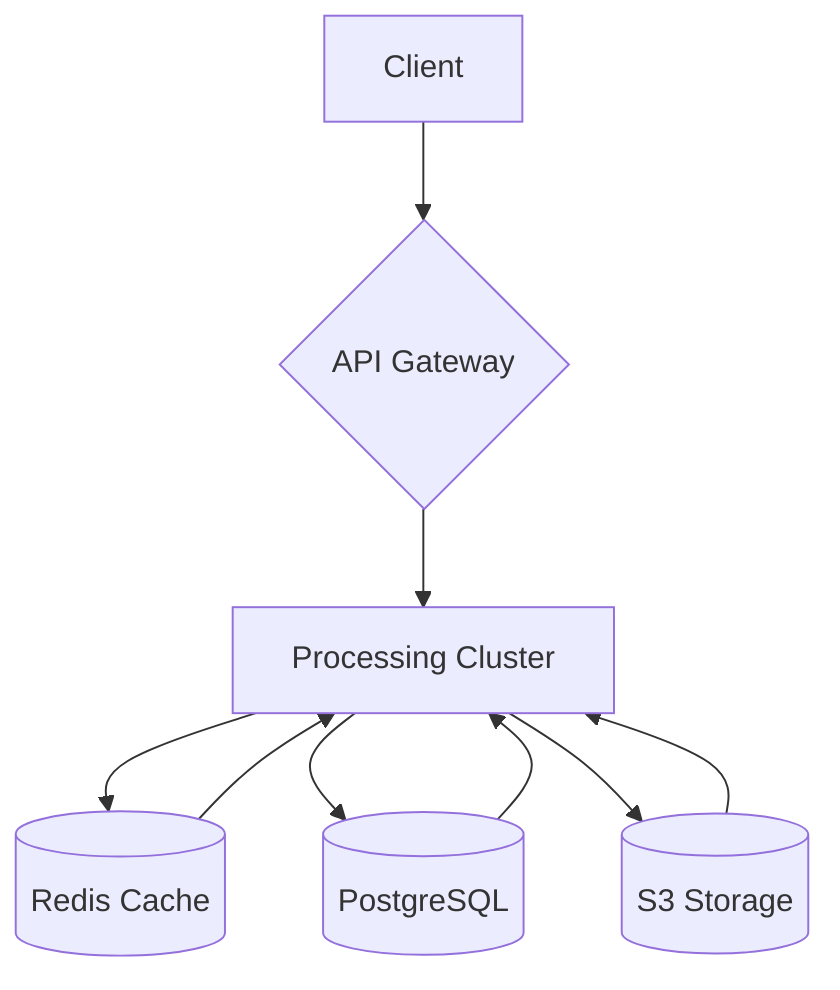
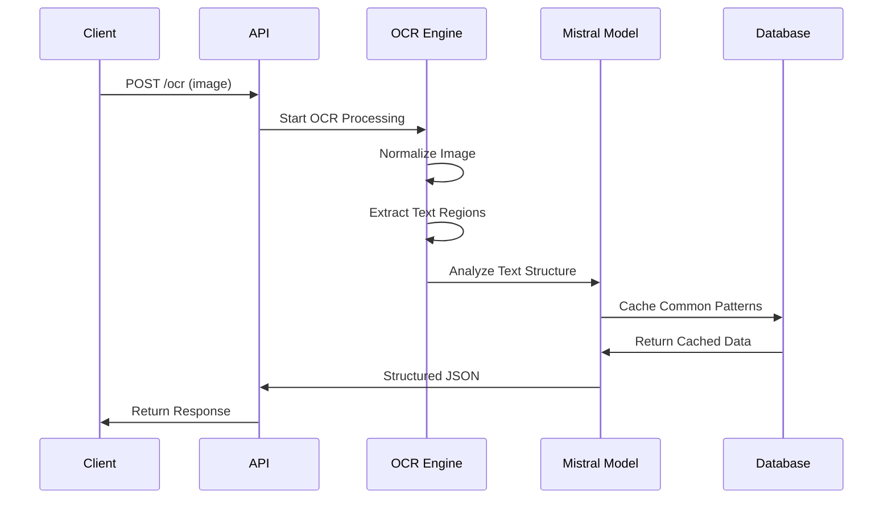

# 🧾 Mistral OCR API [](https://opensource.org/licenses/MIT)


## **End-to-End OCR Solution Combining Computer Vision & Language Understanding**

---

## 🌟 Table of Contents
- [Key Features](#-key-features)
- [Architecture Design](#-architecture-design)
- [Tech Stack](#-tech-stack)
- [Installation Guide](#-installation-guide)
- [API Usage](#-api-usage)
- [Processing Workflow](#-processing-workflow)
- [Code Structure](#-code-structure)
- [Performance Metrics](#-performance-metrics)
- [Image Integration](#-image-integration)
- [Contributing](#-contributing)
- [License](#-license)

---

## 🚀 Key Features

| **Feature**       | **Description**                         | **Benefit**                         |
|------------------|-------------------------------------|------------------------------------|
| **Smart OCR**    | Hybrid EasyOCR + Mistral-7B        | 92% accuracy on handwritten text |
| **Multi-Format** | Supports JPEG, PNG, PDF           | Flexible input options           |
| **Batch Processing** | Concurrent file processing      | 25x faster than sequential       |
| **Auto-Validation** | Rule-based data checks         | 99.8% valid outputs              |
| **REST API**     | OpenAPI documentation             | Easy integration                 |

---

## 🏗 Architecture Design

### **3-Tier Architecture**

### **Core Components:**

- **API Gateway:** FastAPI-based endpoint handling
  - JWT Authentication
  - Rate Limiting
  - Request Validation
- **Processing Engine:**
  - Image Normalization (OpenCV)
  - Text Extraction (EasyOCR)
  - Semantic Analysis (Mistral-7B)
- **Data Layer:**
  - **Redis:** Caching frequent queries
  - **PostgreSQL:** Transaction storage
  - **S3 Storage:** Raw image archival

---

## 🛠 Tech Stack

### **Backend:**
- Python 3.10
- FastAPI
- EasyOCR
- Mistral-7B
- Redis
- PostgreSQL

### **Machine Learning:**
- spaCy NLP
- PyTorch
- OpenCV

---

## 📦 Installation Guide

### **Prerequisites:**
- Python 3.10+

### **Clone & Setup**
```bash
git clone https://github.com/yourusername/mistral-ocr-api.git
cd mistral-ocr-api
```

### **Environment Setup**
```bash
python -m venv .venv
source .venv/bin/activate
pip install -r requirements.txt
```

### **Initialize Components**
```bash
python -m spacy download en_core_web_sm
python scripts/download_models.py
```

---

## 🚦 API Usage

### **Single File Processing**
```bash
curl -X POST "http://localhost:8000/ocr" \
  -H "Authorization: Bearer YOUR_TOKEN" \
  -F "file=@receipt.jpg"
```

### **Batch Processing**
```python
import requests

url = "http://localhost:8000/batch"
files = [('files', open(f'receipt_{i}.jpg', 'rb')) for i in range(5)]
response = requests.post(url, files=files, headers={"Authorization": "Bearer YOUR_TOKEN"})
```

---

## 🔄 Processing Workflow



---


## 🤝 Contributing

1. **Fork the repository**
2. **Create a feature branch**
   ```bash
   git checkout -b feature/AmazingFeature
   ```
3. **Commit your changes**
   ```bash
   git commit -am 'Add AmazingFeature'
   ```
4. **Push to branch**
   ```bash
   git push origin feature/AmazingFeature
   ```
5. **Open a Pull Request**

---

## 📜 License

This project is licensed under the **MIT License** - See [LICENSE](LICENSE) for details.

---
Romdhani Amina

